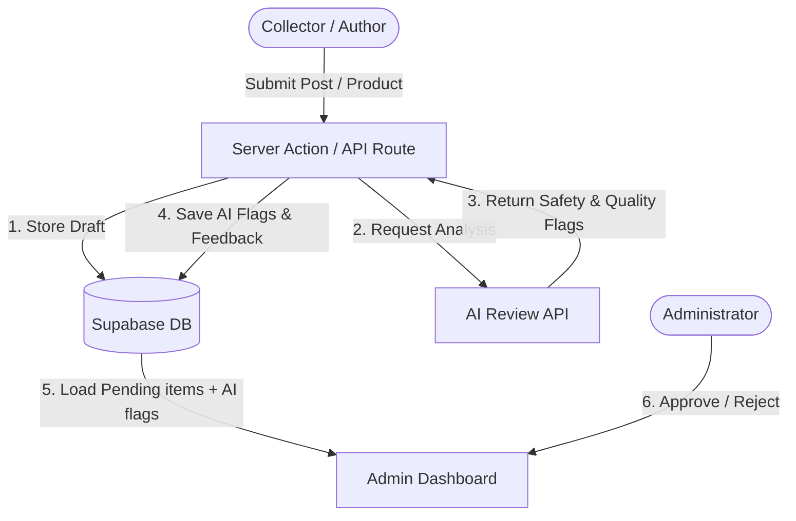

# Kwago: Minimalist Collector's Journal & Shop

Kwago is a clean, high-performance platform combining a content-first blog for collectors with a minimalist shop for action figures and statues.

## Tech Stack

- **Framework**: Next.js 16 (App Router) / React 19 (Experimental/Preview environment)
- **Styling**: Tailwind CSS 4
- **Database**: Supabase (`@supabase/ssr`)
- **State Management**: Zustand
- **Icons**: Lucide React
- **Components**: shadcn/ui (base-nova style), Base UI
- **Content**: MDX (`next-mdx-remote`)

## Domain Model

- **Blog Posts**: Educational and community content for collectors (e.g., authenticity guides, maintenance).
- **Products**: High-end collectibles (Marvel Legends, Weta Workshop statues), supporting both 'New' and 'Used' conditions.

## AI Content Moderation & Reviews (Proposed)

> [!NOTE]
> The AI review feature is **currently not implemented**.

If implemented with a real API (e.g., Google Gemini API, OpenAI API, or a dedicated moderation endpoint), it will be used to automatically perform safety, quality, and categorization checks on blog posts and product submissions before they are shown to the administrator for final approval.

### Intended Flow & Integration Points

When a user submits a blog post or lists a new product:
1. **Submission**: The user submits the entry via a Next.js Server Action or API endpoint.
2. **AI Review Trigger**: The backend triggers an asynchronous AI evaluation call using the submission's text and metadata.
3. **Moderation Status**:
   - The submission is marked as `status: "pending_review"`.
   - The AI results (relevance score, flags for inappropriate content, category verification, suggested tags) are stored in an `ai_reviews` table linked to the post or product.
4. **Admin Dashboard**:
   - The post or product appears in the Admin Dashboard along with the AI review report (e.g., confidence scores, flagged issues).
   - The administrator uses this AI analysis to streamline the final manual approval/rejection step.

### Structural Flow

## Design Philosophy ("Clarity over Complexity")

- **Typography**: Inter/Geist font family.
- **Color Palette**: Zinc-based (zinc-900 for headings, zinc-500 for body). Primary accent is #0066FF.
- **Shadows**: **Strictly zero shadows.** Use flat backgrounds and subtle borders for separation.
- **Shapes**: Pill-shaped (rounded-full) buttons and inputs.
- **Spacing**: 8px grid system with generous white space.

## Project Structure

- `app/`: Next.js App Router pages and layouts (e.g., `(auth)`, `blog`, `shop`, `dashboard`).
- `components/`:
  - `ui/`: Atomic components (Button, Input, Badge).
  - `layout/`: Structural components (Navbar, Footer, Modals).
  - `blog/`: Domain components for the journal (PostCard, HeroPost).
  - `shop/`: Domain components for the shop (ProductCard, ProductGrid).
  - `auth/`: Authentication-related components.
  - `dashboard/`: Admin and author dashboard components.
  - `providers/`: Context providers.
- `lib/`:
  - `supabase/`: Supabase client configuration and SSR utilities.
  - `store.ts`: Zustand store for global application state.
  - `utils/`, `utils.ts`: Utility functions.
  - `services/`: Business logic and external API integrations.
  - `hooks/`: Custom React hooks.
  - `data/`: Data fetching utilities.
  - `auth.ts`, `i18n.ts`: Auth and internationalization helpers.
- `types/`: TypeScript interfaces and definitions (`index.ts`, `post.ts`, `product.ts`, `sales.ts`).

## Key Commands

- **Development**: `npm run dev`
- **Build**: `npm run build`
- **Start**: `npm run start`
- **Lint**: `npm run lint`

## Development Guidelines

- **Modern React/Next.js**: This project uses Next.js 16 and React 19. Be cautious with legacy patterns and refer to the latest documentation (or `node_modules/next/dist/docs/`).
- **Styling**: Always use Tailwind CSS 4 utility classes. Adhere to the "Zero Shadows" rule.
- **Data Fetching**: Use Supabase. Server Components are preferred for data fetching where possible.
- **State**: Use Zustand (`lib/store.ts`) for cross-component UI state (e.g., search status, active filters).
- **Icons**: Use `lucide-react`.

## Important Files

- `DESIGN.md`: Detailed design specifications.
- `AGENTS.md`: Important warnings about the experimental Next.js version.
- `seed_data.sql`: Database schema and initial data.
